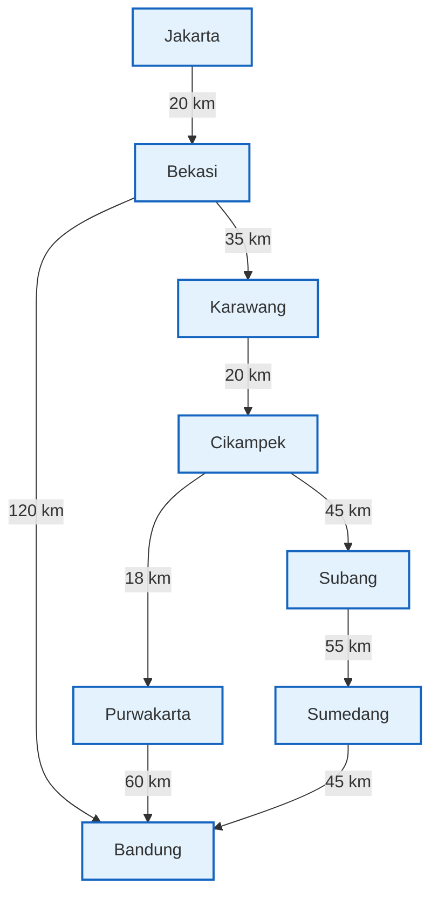

# LAPORAN ANALISIS AKADEMIS
## IMPLEMENTASI SISTEM MANAJEMEN & ROUTING PAKET LOGISTIK (IN-MEMORY SIMULATOR)

**Mata Kuliah:** Struktur Data  
**Dosen Pengampu:** Tim Dosen & Asisten Akademik  
**Studi Kasus:** Simulasi Distribusi Logistik Hub Terdistribusi  

---

## BAB I: PERANCANGAN ABSTRACT DATA TYPE (ADT)

Dalam merancang aplikasi CLI manajemen logistik in-memory ini, pemilihan struktur data yang tepat adalah hal yang paling krusial. Program ini kami rancang secara khusus untuk bekerja secara murni pada memori utama (RAM) menggunakan **alokasi memori dinamis (pointer manual)**. Kami menghindari penggunaan *database* eksternal maupun *library container* dari Standard Template Library (STL) seperti `std::vector`, `std::queue`, atau `std::list`. Hal ini bertujuan agar kami dapat mendemonstrasikan pemahaman mendalam mengenai manipulasi pointer, alokasi heap (`new`/`delete`), dan manajemen memori.

Berikut adalah rancangan tipe data abstrak (ADT) yang kami implementasikan di dalam sistem:

### 1. Representasi Struktur Data dalam Kode

#### A. Node Histori Perjalanan (`struct NodeHistori`)
Struktur data ini mewakili setiap simpul log dalam rantai riwayat perjalanan paket (*traceability*). Node ini dirancang menggunakan konsep *Singly Linked List*.
```cpp
struct NodeHistori {
    std::string kotaTransit; // Kota tempat paket lagi mampir / transit
    std::string status;      // Catatan kayak "Paket didaftarkan", "Transit", dll.
    std::string waktuLog;    // Waktu simulasi (misal: "H+1 10:00")
    NodeHistori* next;       // Pointer ke log berikutnya
};
```
*   **Analisis Peran:** Setiap paket memiliki pointer ke rentetan simpul histori ini. Dinamisme *linked list* memungkinkan log perjalanan bertambah seiring pergerakan paket antar-hub tanpa perlu menetapkan batas atas ukuran array di awal.

#### B. Objek Paket (`struct Paket`)
Objek ini merepresentasikan paket fisik logistik yang bergerak melintasi jaringan hub kota.
```cpp
struct Paket {
    std::string resi;         // Nomor resi unik paket
    std::string asal;         // Hub asal pertama kali kirim
    std::string tujuan;       // Tujuan akhir paket
    std::string currKota;     // Kota posisi paket saat ini
    NodeHistori* headHistori; // Head buat list histori perjalanan
    NodeHistori* tailHistori; // Tail buat insert last log secara instan O(1)
};
```
*   **Analisis Peran:** Paket menyimpan data esensial perjalanan dan memegang kendali atas rantai memorinya sendiri. Ketika paket dihapus (`delete`), destruktor kustomnya akan secara rekursif menghapus semua `NodeHistori` guna mencegah kebocoran memori (*memory leak*). Kami juga menggunakan pointer `tailHistori` agar proses penyisipan log baru di akhir linked list (*insert last*) berjalan instan $O(1)$.

#### C. Antrean FIFO Gudang Hub (`class QueueGudang` berbasis Linked List)
Setiap hub kota memiliki gudang sortir tempat paket mengantre untuk diproses (*dispatch*).
```cpp
struct NodeQueue {
    Paket* dataPaket;    // Pointer ke objek Paket dinamis
    NodeQueue* next;     // Pointer ke antrean belakangnya
};

class QueueGudang {
private:
    NodeQueue* depan;    // Pointer antrean paling depan (buat Dequeue O(1))
    NodeQueue* belakang; // Pointer antrean paling belakang (buat Enqueue O(1))
    int jumlahPaket;     // Counter size antrean gudang
};
```
*   **Analisis Peran:** Antrean bekerja dengan prinsip *First-In, First-Out* (FIFO). Alokasi memori dinamis memastikan gudang hub dapat menampung paket dari kapasitas nol hingga kapasitas maksimum RAM tanpa adanya pemborosan memori jika antrean sedang kosong.

#### D. Directed Graph Representasi Peta Distribusi (`class GrafPeta` berbasis Adjacency List)
Peta distribusi rute antar-kota dimodelkan sebagai graf berarah (*directed graph*) dengan representasi *Adjacency List*.
```cpp
struct EdgeRute {
    std::string kotaTujuan; // Nama kota tetangga yang terhubung
    int jarakKm;            // Bobot rute (jarak dalam km)
    EdgeRute* next;         // Pointer ke rute tetangga berikutnya
};

struct NodeKota {
    std::string namaKota;     // Nama kota sebagai simpul / vertex
    QueueGudang gudangHub;    // Antrean gudang logistik eksklusif di kota ini
    EdgeRute* listTetangga;   // Head untuk adjacency list rute keluar
    NodeKota* next;           // Pointer ke vertex kota berikutnya di dalam graf
};
```
*   **Analisis Peran:** Dibandingkan menggunakan matriks ketetanggaan (*Adjacency Matrix*) berukuran $V \times V$ yang boros memori ketika graf bersifat renggang (*sparse*), *Adjacency List* berbasis pointer sangat efisien hanya menggunakan memori proporsional terhadap jumlah rute keluar yang benar-benar ada.

---

### 2. Rekomendasi Visualisasi Graf Peta Rute Distribusi

Untuk memvalidasi jalannya algoritma penentuan rute terdekat, model jaringan logistik di bawah ini mewakili skenario nyata wilayah Jawa Barat dan Jabodetabek:

#### A. Diagram Alir Rute Graf (Mermaid)
Berikut adalah bagan konektivitas berarah dari delapan hub logistik beserta bobot jarak antar kota (km):



#### B. Visualisasi ASCII Peta Hub
```text
 [ Jakarta ]
     │
     ▼ (20 km)
 [ Bekasi ] ─────────────────────────┐
     │                               │
     ▼ (35 km)                       │
 [ Karawang ]                        │
     │                               │
     ▼ (20 km)                       │ (120 km Toll)
 [ Cikampek ]                        │
     ├───► (18 km) ──► [ Purwakarta ]│
     │                      │        │
     ▼ (45 km)              ▼ (60 km)│
  [ Subang ]             [ Bandung ] ◄┘
     │                      ▲
     ▼ (55 km)              │ (45 km)
 [ Sumedang ] ──────────────┘
```

**Analisis Jalur Skenario (Jakarta ke Bandung):**
Sistem perutean otomatis memiliki tiga alternatif utama untuk mengirim paket dari Jakarta ke Bandung:
1.  **Jalur Tol Langsung:** Jakarta $\rightarrow$ Bekasi $\rightarrow$ Bandung (Total: $20 + 120 = 140\text{ km}$ | 2 *hops*).
2.  **Jalur Purwakarta:** Jakarta $\rightarrow$ Bekasi $\rightarrow$ Karawang $\rightarrow$ Cikampek $\rightarrow$ Purwakarta $\rightarrow$ Bandung (Total: $20 + 35 + 20 + 18 + 60 = 153\text{ km}$ | 5 *hops*).
3.  **Jalur Subang-Sumedang:** Jakarta $\rightarrow$ Bekasi $\rightarrow$ Karawang $\rightarrow$ Cikampek $\rightarrow$ Subang $\rightarrow$ Sumedang $\rightarrow$ Bandung (Total: $20 + 35 + 20 + 45 + 55 + 45 = 220\text{ km}$ | 6 *hops*).

Algoritma Dijkstra yang kami integrasikan secara otomatis akan memilih alternatif pertama ($140\text{ km}$) sebagai rute terpendek yang paling efisien, meskipun melewati tol dengan bobot edge tunggal yang besar.

---

## BAB II: IMPLEMENTASI FUNGSI & ALGORITMA

Bagian ini membahas penjelasan mendalam mengenai alur logika dan manipulasi pointer pada fungsionalitas inti simulator logistik yang telah kami buat.

### 1. Alur Algoritma Enqueue dan Dequeue Paket pada Antrean Hub Kota

Operasi pada `QueueGudang` di tiap hub kota merupakan implementasi struktur data antrean dinamis berbasis *linked list*. Hal ini menjamin waktu eksekusi yang optimal untuk manajemen gudang logistik.

#### A. Operasi Enqueue (Masuk Gudang)
Operasi `masukAntrean` menambahkan paket baru ke bagian belakang antrean (*belakang*).

```text
Alur Logika:
1. Alokasikan NodeQueue baru (nodeBaru) secara dinamis menggunakan memori 'new'.
2. Setel nodeBaru->dataPaket menunjuk ke objek Paket yang didaftarkan.
3. Setel nodeBaru->next = nullptr.
4. JIKA antrean kosong (depan == nullptr):
     Setel depan = nodeBaru
     Setel belakang = nodeBaru
5. JIKA antrean TIDAK kosong:
     Setel belakang->next = nodeBaru
     Setel belakang = nodeBaru
6. Naikkan variabel counter 'jumlahPaket' sebesar 1.
```
*   **Keunggulan Pointer:** Dengan menyimpan pointer langsung ke simpul belakang (`belakang`), proses penyisipan paket baru di akhir antrean berjalan secara konstan dengan kompleksitas waktu $O(1)$, tanpa perlu melakukan iterasi dari simpul terdepan.

#### B. Operasi Dequeue (Keluar Gudang untuk Transit)
Operasi `keluarAntrean` mengambil dan mengeluarkan paket dari bagian depan antrean (*depan*).

```text
Alur Logika:
1. JIKA antrean kosong (depan == nullptr), kembalikan nullptr.
2. JIKA antrean tidak kosong:
     Buat penunjuk sementara: temp = depan.
     Ambil objek paket: Paket* p = temp->dataPaket.
     Geser pointer depan: depan = depan->next.
3. JIKA pergeseran menghasilkan depan == nullptr (antrean menjadi kosong):
     Setel belakang = nullptr.
4. Hapus simpul sementara dari memori: delete temp.
5. Kurangi variabel counter 'jumlahPaket' sebesar 1.
6. Kembalikan p.
```
*   **Keamanan Memori:** Proses `keluarAntrean` hanya menghapus node pembungkus antrean (`NodeQueue`), bukan objek `Paket` itu sendiri. Objek paket tetap hidup di dalam memori dinamis untuk dialihkan ke hub kota berikutnya.

---

### 2. Logika Pemanfaatan Pointer pada Linked List Histori

Kemampuan *traceability* (pelacakan resi) diimplementasikan menggunakan linked list histori kustom yang terintegrasi langsung di dalam setiap objek paket (`Paket`).

Setiap kali terjadi aksi pengiriman atau transit:
1.  Sistem melakukan `keluarAntrean` pada paket di hub asal.
2.  Sistem menghitung kota tujuan transit berikutnya menggunakan pathfinding Dijkstra.
3.  Sistem memanggil fungsi `p->tambahLogHistori(kotaTransitBerikutnya, logMessage, waktuSimulasi)`.

```text
Mekanisme Manipulasi Pointer 'Insert Last':
[headHistori] ──────────────────────┐
                                    ▼
                             ┌─────────────┐     ┌─────────────┐
                             │ NodeHistori │ ──► │ NodeHistori │ (Log Terlama)
                             └─────────────┘     └─────────────┘
                                                        ▲
[tailHistori] ──────────────────────────────────────────┘
                                                        │ (Penyisipan instan)
                                                 ┌─────────────┐
                                                 │ NodeHistori │ (Log Baru)
                                                 └─────────────┘
```

**Kode Implementasi:**
```cpp
void tambahLogHistori(std::string kt, std::string stat, std::string wkt) {
    NodeHistori* logBaru = new NodeHistori(kt, stat, wkt); // Alokasi dinamis log baru
    if (headHistori == nullptr) {
        headHistori = logBaru;
        tailHistori = logBaru;
    } else {
        tailHistori->next = logBaru; // Sambungkan dari simpul lama terakhir
        tailHistori = logBaru;       // Perbarui tail ke simpul baru
    }
}
```

*   **Tanpa Batas Alokasi Tetap:** Berbeda dengan array statis yang mengharuskan pendefinisian kapasitas maksimum log di awal (misal: `string log[100]`), linked list berbasis pointer dapat menampung jumlah log transit secara tak terbatas (hanya dibatasi oleh sisa kapasitas RAM). Hal ini sangat ideal untuk mensimulasikan rute paket yang sangat panjang dan mengalami banyak transit.

---

### 3. Fungsi Pencarian Data Paket di Memori Berdasarkan Pencocokan String Resi

Setiap paket yang didaftarkan ke dalam sistem akan secara otomatis dicatat dalam sebuah **Global Package Registry** (`NodeRegistryGlobal* headRegistryPaket`). Registry ini berupa *Singly Linked List* yang merekam lokasi memori dari setiap objek paket yang ada di seluruh simulator.

Fungsi pencarian memindai registry ini secara sekuensial dengan mencocokkan string nomor resi paket:

```cpp
Paket* cariPaketDiRegistry(std::string resi) const {
    NodeRegistryGlobal* curr = headRegistryPaket;
    while (curr != nullptr) {
        if (curr->dataPaket->resi == resi) {
            return curr->dataPaket; // Paket ditemukan, kembalikan alamat memori objek Paket
        }
        curr = curr->next; // Geser ke simpul pencatat berikutnya
    }
    return nullptr; // Resi tidak terdaftar di sistem
}
```

*   **Pentingnya Global Registry:** Keberadaan list global ini memungkinkan pengguna melacak paket secara langsung via CLI menggunakan nomor resi kapan pun, terlepas dari kota mana paket tersebut saat ini mengantre. Hal ini juga mempermudah pembebasan memori secara menyeluruh saat program dihentikan dengan melakukan iterasi pembersihan pada list global ini, sehingga terhindar dari bahaya memory leak.

---

## BAB III: ANALISIS EFISIENSI & KOMPLEKSITAS

Pada bab ini, kami meninjau performa dan efisiensi algoritma yang digunakan dalam sistem dari sudut pandang teoretis ilmu komputer menggunakan Notasi Big O.

### 1. Analisis Performa Algoritma Menggunakan Notasi Big O

#### A. Algoritma Pencarian Resi Paket (Traceback Search)
*   **Waktu Kompleksitas (Time Complexity): $O(N)$**  
    Di mana $N$ adalah total seluruh paket yang terdaftar di dalam sistem. Karena pencarian menggunakan *Singly Linked List* registry global yang tidak berurutan, dalam kasus terburuk (*worst case*), sistem harus memeriksa seluruh simpul dari awal hingga akhir untuk menemukan resi target atau memastikan resi tersebut tidak ada.
*   **Ruang Kompleksitas (Space Complexity): $O(1)$**  
    Pencarian dilakukan secara *in-place* melalui traversal pointer pembantu (`curr`). Sistem tidak mengalokasikan struktur memori tambahan selama proses pencarian berlangsung.

#### B. Algoritma Perutean Rute Terdekat (Dijkstra Pointer-Based)
Karena sistem ini dirancang secara murni menggunakan alokasi pointer tanpa memanfaatkan *binary heap* atau *priority queue* bawaan STL, analisis efisiensi Dijkstra-nya adalah sebagai berikut:
*   **Waktu Kompleksitas (Time Complexity): $O(V^2 + E)$**  
    Di mana $V$ adalah jumlah kota hub (Vertex) dan $E$ adalah jumlah rute logistik (Edge).
    *   Mencari vertex belum dikunjungi dengan jarak minimal memerlukan traversal linear melalui linked list Dijkstra pembantu yang memiliki ukuran $V$, dilakukan sebanyak $V$ kali: $O(V^2)$.
    *   Proses relaxasi/update jarak untuk setiap tetangga pada adjacency list dilakukan sekali untuk setiap edge sepanjang algoritma: $O(E)$.
    *   Secara total, waktu yang dibutuhkan adalah $O(V^2 + E)$. Untuk graf berukuran skala laboratorium (seperti $V = 8$ kota), algoritma ini berjalan secara instan (< 1 milidetik).
*   **Ruang Kompleksitas (Space Complexity): $O(V)$**  
    Sistem mengalokasikan struktur pembantu berupa linked list `NodeDijkstra` yang berukuran tepat sama dengan jumlah Vertex ($V$) di dalam graf. Setelah rute terdekat diperoleh dan transit dialihkan, seluruh memori pembantu ini segera di-deallokasi kembali ke sistem operasi sehingga space complexity-nya tetap efisien sebesar $O(V)$ secara temporer.

---

### 2. Evaluasi Teoretis Struktur Data Dinamis vs Struktur Data Statis

Pemilihan struktur data dinamis berbasis pointer murni menawarkan keunggulan mutlak dibandingkan alternatif struktur data statis (seperti array primitif) untuk aplikasi logistik.

Berikut adalah tabel perbandingan komparatif di antara keduanya:

| Fitur Analisis | Struktur Data Dinamis (Linked List/Graph Pointer) | Struktur Data Statis (Array Primitif/Matriks) |
| :--- | :--- | :--- |
| **Alokasi Memori** | Alokasi dinamis saat runtime (*heap*), memori hanya dikonsumsi sesuai kebutuhan nyata. | Alokasi statis saat kompilasi (*stack/global*), ukuran memori sudah terkunci sejak awal. |
| **Batas Kapasitas** | Fleksibel tanpa batas (selama memori RAM masih tersedia). | Memiliki batas tetap (*hard limit*), rentan terjadi *Stack/Buffer Overflow*. |
| **Operasi Log (Insert Last)**| $O(1)$ secara konstan dengan menggunakan pointer `tail`. | $O(1)$ jika indeks diketahui, namun jika melebihi batas harus membuat array baru $O(N)$. |
| **Penyisipan/Penghapusan** | Sangat cepat ($O(1)$) tanpa memerlukan pergeseran elemen memori. | Lambat ($O(N)$) karena harus menggeser elemen di memori untuk menjaga kerapatan array. |
| **Konsumsi Memori Graf** | Graf $O(V + E)$ dengan Adjacency List. Sangat hemat untuk graf logistik renggang. | Graf $O(V^2)$ jika menggunakan Matriks Ketetanggaan. Banyak sel bernilai `0` yang mubazir. |

#### Evaluasi Mendalam Kasus Riwayat Perjalanan Paket (Log Transit)
Dalam sistem logistik dunia nyata, jumlah transit sebuah paket sangat bervariasi:
*   Sebuah paket ekspres mungkin hanya membutuhkan **1 kali log transit** (Jakarta $\rightarrow$ Bandung).
*   Sebuah paket yang mengalami salah sortir atau kendala cuaca ekstrem mungkin membutuhkan **puluhan kali transit** sebelum akhirnya sampai di tujuan.

Jika kita menggunakan **array statis**, kita dipaksa untuk mendeklarasikan ukuran tetap maksimum di awal, misalnya `string riwayat[100]`. Pendekatan ini memiliki cacat akademis yang fatal:
1.  **Mubazir Memori (Underflow):** Jika mayoritas paket hanya melakukan 2-3 kali transit, maka sisa 97 slot memori string pada setiap paket akan teralokasi sia-sia di RAM. Ini adalah pemborosan besar jika jumlah paket mencapai jutaan.
2.  **Kegagalan Sistem (Overflow):** Jika sebuah paket mengalami hambatan distribusi luar biasa dan membutuhkan transit ke-101, sistem akan mengalami *Crash* karena melanggar batas memori array statis (*index out of bounds*).

Dengan memanfaatkan **Linked List Dinamis**, setiap transit direpresentasikan oleh alokasi dinamis `NodeHistori` baru berukuran minimal. Ketika paket dialihkan ke kota baru, barulah memori untuk log baru disisipkan secara instan. Desain modular pointer murni ini memadukan efisiensi tinggi penggunaan memori dengan ketahanan program yang tangguh dari risiko kegagalan sistem.
